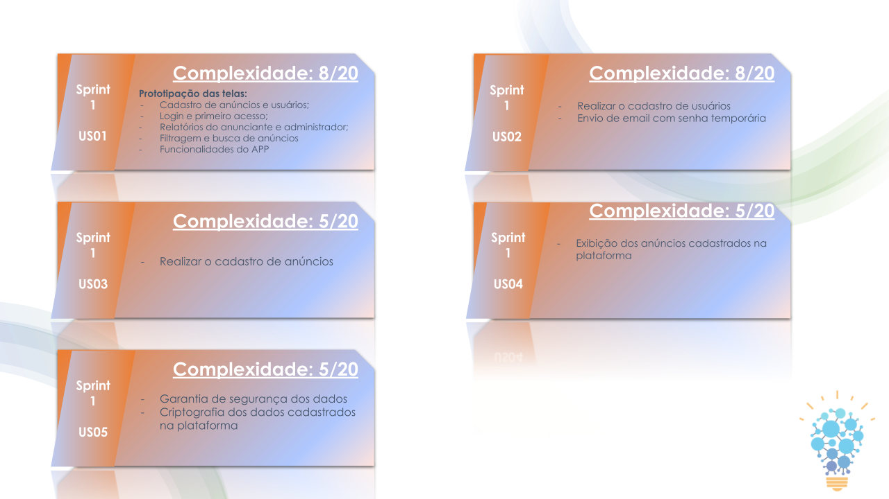
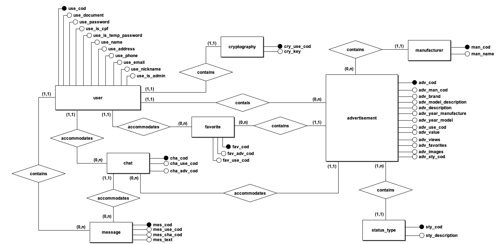
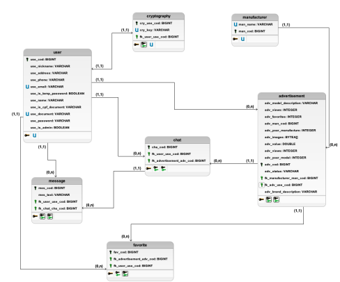
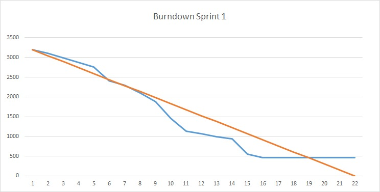

# BureAuto

<div align="center">
  
<p align="center">Plataforma de anúncios de veículos</p>

Desenvolvido pela [BureauTech](https://github.com/BureauTech).

</div>

# Sumário

   * [Sobre](#bureauto)
   * [Sumário](#sumário)
   * [Protótipo das telas da aplicação](#protótipo-das-telas-da-aplicação)
   * [Acompanhamento das Atividades](#acompanhamento-das-atividades)
   * [Entregas](#entregas)
        * [Modelagem de Dados](#modelagem-de-dados)
      * [Burndown](#burndown)
      * [Backlog](#backlog)
   * [Como executar localmente](#como-executar-localmente)
      * [Pré-Requisitos](#pré-requisitos)
      * [Servidor](#servidor)
      * [Cliente](#cliente)
   * [Tecnologias](#tecnologias)
   * [Autores](#autores)

## Protótipo das telas da aplicação


<br>

Protótipo interativo das telas está disponível neste link: https://bit.ly/BureAuto

<br>

# Entregas

- [Sprint 1](https://github.com/BureauTech/BureAuto/releases/tag/0.1.0) entrega realizada em 19/09/2021.

## Entregas propostas

<div align="center">
  
</div>
<br/> 

## Modelagem de Dados
- Modelo Conceitual 
  
<div align="center">
  
 </div>
<br/>

- Modelo Lógico
  
<div align="center">

</div>
<br/>  

## Burndown

<div align="center">
  
</div>
<br/> 

## Backlog 

- [Product Backlog](./doc/artefatos/product_backlog_bureauto.pdf)

# Como executar localmente

Para executar a aplicação completa localmente, siga as intruções a seguir:

### Pré-requisitos:

Antes de começar, você vai precisar ter instalado em sua máquina as seguintes ferramentas:

```
NodeJS - Versão: 15.x.x
PostgreSQL - Versão: 12.x
VueJS - Versão 2.x
```

Além disto é bom ter um editor para trabalhar com o código como VSCode.

## Servidor

1. Na pasta [***src/server***](/src/server), execute os comandos abaixo: <br>

```
npm install
npm run dev
```

Ficará disponível em [localhost:3000](http://localhost/3000)

2. Execute no seu SGBD, todos os scripts SQL disponíveis na pasta [***src/server/resources***](/src/server/resources/)

## Cliente

Na pasta [***src/client/***](/src/client): <br>

1. Faça a instalação dos módulos e execute-os:
   
```
npm install
npm run dev
```

Ficará disponível em [localhost:3001](http://localhost/3001)

# Tecnologias

As seguintes ferramentas foram usadas na construção do projeto:

- [NodeJS](https://nodejs.org/)
- [PostgreSQL](https://www.postgresql.org/)
- [VueJS](https://vuejs.org/)

Bibliotecas:

- [cookie-parser](https://www.npmjs.com/package/cookie-parser)
- [cors](https://www.npmjs.com/package/cors)
- [dotenv](https://www.npmjs.com/package/dotenv)
- [ejs](https://www.npmjs.com/package/ejs)
- [express](https://www.npmjs.com/package/express)
- [express-fileupload](https://www.npmjs.com/package/express-fileupload)
- [jsonwebtoken](https://www.npmjs.com/package/jsonwebtoken)
- [nodemailer](https://www.npmjs.com/package/nodemailer)
- [papaparse](https://www.npmjs.com/package/papaparse)
- [pg](https://www.npmjs.com/package/pg)
- [secure-random-password](https://www.npmjs.com/package/secure-random-password)
- [typeorm](https://www.npmjs.com/package/typeorm)
- [axios](https://www.npmjs.com/package/axios)
- [core-js](https://www.npmjs.com/package/core-js)
- [vue-router](https://www.npmjs.com/package/vue-router)
- [vue-toasted](https://www.npmjs.com/package/vue-toasted)
- [vuetify](https://www.npmjs.com/package/vuetify)
- [vuex](https://www.npmjs.com/package/vuex)

# Autores

<table align="center">
  <tr>
    <td align="center"><a href="https://github.com/bibiacoutinho"><br /><sub><b>Beatriz Coutinho<br>Master</b></sub></a><br /><a href="https://github.com/BureauTech/BureAuto/commits?author=bibiacoutinho" title="Master">:headphones::nail_care::computer_mouse:</a></td>
        <td align="center"><a href="https://github.com/anaclaragraciano"><br /><sub><b>Ana Clara<br>PO</b></sub></a><br /><a href="https://github.com/BureauTech/BureAuto/commits?author=anaclaragraciano" title="PO">:sparkles::iphone::open_book:</a></td>
       <td align="center"><a href="https://github.com/caiquesjc"><br /><sub><b>Caique Nascimento<br>Dev</b></sub></a><br /><a href="https://github.com/BureauTech/BureAuto/commits?author=caiquesjc" title="Dev Team">:keyboard::desktop_computer::computer_mouse:</a></td>     
</table>
<table align="center">
    <td align="center"><a href="https://github.com/charles-ramos"><br /><sub><b>Charles Ramos<br>Dev</b></sub></a><br /><a href="https://github.com/BureauTech/BureAuto/commits?author=charles-ramos" title="Dev Team">:fist_raised::open_book::hamburger:</a></td>
    <td align="center"><a href="https://github.com/danielsantosoliveira"><br /><sub><b>Daniel Oliveira<br>Dev</b></sub></a><br /><a href="https://github.com/BureauTech/BureAuto/commits?author=danielsantosoliveira" title="Dev Team">:computer::guitar::soccer:</a></td>
    <td align="center"><a href="https://github.com/Denis-Lima"><br /><sub><b>Denis Lima<br>Dev</b></sub></a><br /><a href="https://github.com/BureauTech/BureAuto/commits?author=Denis-Lima" title="Dev Team">:computer::v::pizza:</a></td>
    <td align="center"><a href="https://github.com/WeDias"><br /><sub><b>Wesley Dias<br>Dev</b></sub></a><br /><a href="https://github.com/BureauTech/BureAuto/commits?author=WeDias" title="Dev Team">:rocket::milky_way::new_moon:</a></td>
  </tr>
</table>